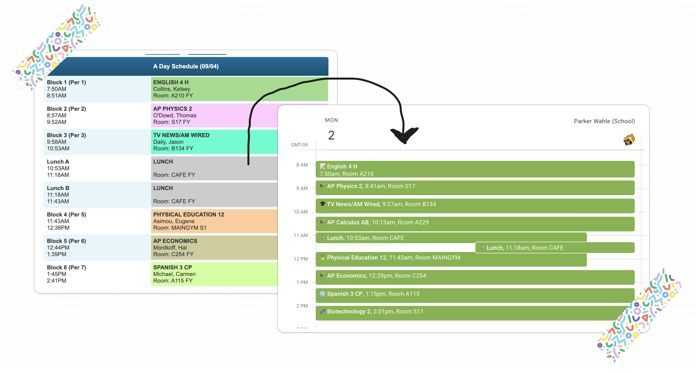

# Genesis Dumper

[][pypi status]
[][pypi status]
[][pypi status]
[][license]

[][read the docs]
[][tests]
[][codecov]

[][pre-commit]
[][black]

[pypi status]: https://pypi.org/project/gdump/
[read the docs]: https://gdump.readthedocs.io/
[tests]: https://github.com/regulad/gdump/actions?workflow=Tests
[codecov]: https://app.codecov.io/gh/regulad/gdump
[pre-commit]: https://github.com/pre-commit/pre-commit
[black]: https://github.com/psf/black

## Features

Export Genesis schedule to an ICS file for importing into a calendar app.



## Installation

You can install _Genesis Dumper_ via [pip] or pipx from [PyPI]:

```console
$ pipx install gdump
$ gdump
```

## Usage

Please see the [Command-line Reference] for details.

* Run `gdump --help`
* Run `gdump`
* Input your username & password when prompted
* Import the `schedule_xxxxxx_xxxx-xxxx.ics` file into your calendar app

## Contributing

Contributions are very welcome.
To learn more, see the [Contributor Guide].

## License

Distributed under the terms of the [GPL 3.0 license][license],
_Genesis Dumper_ is free and open source software.

## Issues

If you encounter any problems,
please [file an issue] along with a detailed description.

## Credits

This project was generated from [@regulad]'s [neopy] template.

[@regulad]: https://github.com/regulad
[pypi]: https://pypi.org/
[neopy]: https://github.com/regulad/cookiecutter-neopy
[file an issue]: https://github.com/regulad/gdump/issues
[pip]: https://pip.pypa.io/

<!-- github-only -->

[license]: https://github.com/regulad/gdump/blob/main/LICENSE
[contributor guide]: https://github.com/regulad/gdump/blob/main/CONTRIBUTING.md
[command-line reference]: https://gdump.readthedocs.io/en/latest/usage.html
